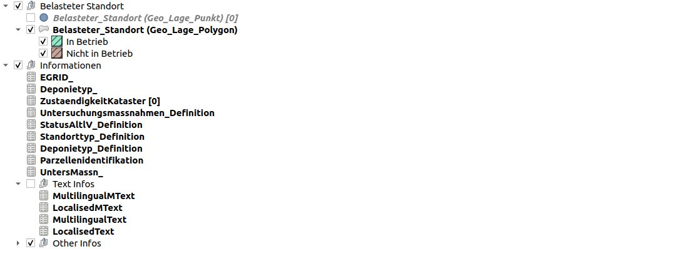
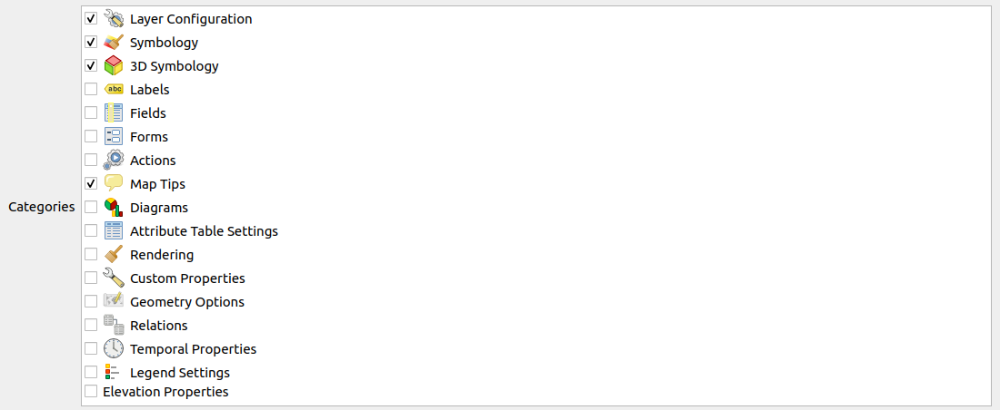

According to a model name, paths to *metaconfiguration files* are found in *ilidata.xml*. These *metaconfiguration files* contain, besides configuration parameters, *DatasetMetadata-Ids*. Based on these *DatasetMetadata-Ids* the paths to the *Toppingfiles* are found in the *ilidata.xml*.

> Other tools might use a different workflow. For example, the *ili2db* is passed the *metaconfiguration file*. There in the *metaconfiguration* then also the model is defined.


#### Workflow
1. The user enters the model name in the [dialog](../../../user_guide/import_workflow/#metaconfiguration-topping).
2. The *ilidata.xml* is parsed for links to *metaconfiguration files* according to the model name.
3. The user selects a *metaconfiguration file*.
4. The *metaconfiguration file* is downloaded.
4. The configurations are read from the *metaconfiguration file*.
5. The configurations are considered in the creation of the physical model.
6. The DatasetMetadata-Ids to the *topping files* are read from the *metaconfiguration file*.
7. The *ilidata.xml* is parsed for links to the  *topping files* based on the DatasetMetadata-Ids.
8. The *topping files* are downloaded
9. The information is read from the *topping files* and included in the generation of the QGIS project.

## ili2db configuration

### General Handling
ili2db configurations are defined in the *metaconfiguration file*.
```ini
[ch.ehi.ili2db]
defaultSrsCode = 2056
smart2Inheritance = true
strokeArcs = false
importTid = true
```

ili2db can be called like this:
```
ili2db --metaConfig ilidata:metconfigId --schemaimport --db....
ili2db --metaConfig ilidata:metconfigId --import --db....
ili2db --metaConfig ilidata:metconfigId --import --db....  data.xtf
ili2db --metaConfig ilidata:metconfigId --export --db....  data.xtf
```

... or with a local *metakonfiguration file*:
```
ili2db --metaConfig localfile.ini --import --db....  data.xtf
```

### Implementation in the Model Baker

> The functionality that the parameters are loaded into the input mask is implemented so far. Otherwise this paragraph describes the SHOULD state. Because the passing of the metaconfiguration as well as the passing of `false` parameters is not yet supported by ili2db and Model Baker.

Some parameters are automatically set in the background when ili2db is called by the Model Baker, and others can be configured by the user in the input mask of the Model Baker. In addition, the relevant *metaconfiguration file* is passed to ili2db. But parameters passed directly to ili2db override the configurations of the passed *metaconfiguration file*.

The Model Baker reads the ili2db parameters from the *metaconfiguration file*. The parameters that can be set via the input mask of the Model Baker (like `--strokeArcs`, `--iliMetaAttrs` (for `toml`) or `--models`) are loaded from the *metaconfiguration file* into the input mask. The user can now customize them. The Model Baker now passes the *metaconfiguration file* and the parameters from the input mask (whether customized or not) to ili2db. So if the parameters were listed in the *metaconfiguration file* but then disabled in the input mask, they will be passed to ili2db as `false`.

The parameters set by the Model Baker in the background (like `--createFkIdx`, `--coalesceMultiPoint`) are still set. But they can be overridden in the *Metaconfigurationfile*. However, if in the *metaconfiguration file* such parameters are not mentioned, then they are also not overridden with`false`.

Exception is a (future) setting like `onlyUseMetaConfigParams` in the *metaconfiguration file*. If this is set, then only the parameters configured in the *metaconfiguration file* should be set and no others.

### Refrencing other INTERLIS models
Using the ili2db settings, it is possible to reference other models from *metaconfiguration files*. If the setting contains the value `models=KbS_LV95_v1_4;KbS_Basis`, then this is also adjusted in the Model Baker input mask. Of course, a search for possible *metaconfiguration files* on UsabILIty Hub will be started again, according to the currently set models. See also for that [Multiple Models and their Toppings](#multiple-models-and-their-toppings).

## Toppings and their Configuration
*Topping files* are files that are referenced in the *metaconfiguration* or in other *topping files* like e.g. the *project topping file* and contain the configuration information of the GIS project or parts of it. So they can be form configurations, style attributes, legend tree structures as well as data files. Individual topping files can be used for each tool.

The Model Baker supports these kinds of *topping files*:

- Project topping files: `yaml` files for project settings like legend display, linking to layer configuration files and layer order
- QML layer properties: `qml` files for layer configurations
- Layer definition: `qlr` files for layer definitions
- Data files: `xtf`/`xml`/`itf` files for data import
### Project Topping (`yaml`)
Information about the project like the layer tree, the layers in the layer tree and the display order may be contained in a *toppingfile*. The `DatasetMetadata-Id` of the file is defined in the *metaconfiguration file* via the parameter `qgis.modelbaker.projecttopping` (or the outdated `qgis.modelbaker.projecttopping`).

The file is written in `yaml`:

```yaml
layertree:
  - "Belasteter Standort":
      group: true
      checked: true
      expanded: true
      mutually-exclusive: true
      mutually-exclusive-child: 1
      child-nodes:
        - "Belasteter_Standort (Geo_Lage_Punkt)":
            featurecount: true
            qmlstylefile: "ilidata:ch.opengis.topping.opengisch_KbS_LV95_V1_4_001"
        - "Belasteter_Standort (Geo_Lage_Polygon)":
            expanded: true
            qmlstylefile: "ilidata:ch.opengis.topping.opengisch_KbS_LV95_V1_4_023"
  - "Informationen":
      group: true
      checked: true
      expanded: true
      child-nodes:
        - "EGRID_":
        - "Deponietyp_":
        - "ZustaendigkeitKataster":
            featurecount: true
        - "Untersuchungsmassnahmen_Definition":
            featurecount: false
        - "StatusAltlV_Definition":
        - "Standorttyp_Definition":
        - "Deponietyp_Definition":
        - "Parzellenidentifikation":
        - "UntersMassn_":
        - "Text Infos":
            group: true
            checked: false
            expanded: true
            child-nodes:
              - "MultilingualMText":
              - "LocalisedMText":
              - "MultilingualText":
              - "LocalisedText":
        - "Other Infos":
            group: true
            checked: true
            expanded: false
            child-nodes:
              - "StatusAltlV":
              - "Standorttyp":
              - "UntersMassn":
              - "Deponietyp":
              - "LanguageCode_ISO639_1":
              - "Another interesting layer":
                definitionfile: "ilidata:ch.opengis.topping.opengisch_roadsigns_layer_101"
              - "WMS Map":
                provider: "wms"
                uri: "contextualWMSLegend=0&crs=EPSG:2056&dpiMode=7&featureCount=10&format=image/jpeg&layers=ch.bav.kataster-belasteter-standorte-oev_lines&styles=default&url=https://wms.geo.admin.ch/?%0ASERVICE%3DWMS%0A%26VERSION%3D1.3.0%0A%26REQUEST%3DGetCapabilities"

layer-order:
  - "Belasteter_Standort (Geo_Lage_Polygon)"
  - "Belasteter_Standort (Geo_Lage_Punkt)"
```

#### Layertree
The layertree is described using a tree structure in the `yaml` format.

Top level entry is `layertree` (or outdated: `legend`). This entry is not shown in the legend.

It can be followed by groups or layers. The following parameters are valid for both types:

- `checked: true/false` defines if the node is visible or not
- `expanded: true/false` defines if the node is expanded or not
- `featurecount: true/false` defines if the number of features should be displayed or not
- `definitionfile: "ilidata..."` defines the path/link to a layer/group definition QLR file.

Groups must be defined as such with the parameter `group: true`. Otherwise it is assumed to be a layer. The groups should contain the parameter `child-nodes` where subgroups and layers can be defined.

Additionally the groups have the `mutually-exclusive` property. This means if the subgroups and layers are mutually exclusive. This means that only one child element can be visible at a time.

- `mutually-exclusive: true` if only one child element should be visible at a time.
- `mutually-exclusive-child: 0` the child element to be displayed.

Layers can additionally have the path/link defined to QML files containing layer properties like form configuration, symbology etc.
- `qmlstylefiles: "ilidata..."` if only one child element should be visible at a time.

And one can define the source directly in the layers as well:
- `provider: "wms"` defines the provider type (supported is `ogr`, `postgres` and `wms`)
- `uri: "contextualWMSLegend=0&crs=EPSG...` defines the layer's source uri.

The `yaml` file shown above results in a legend structure in *QGIS*.



#### Display Order
The display order of the layers is defined as simple list:
```
layer-order:
  - "Belasteter_Standort (Geo_Lage_Polygon)"
  - "Belasteter_Standort (Geo_Lage_Punkt)"
```

#### Multiple Models with multiple Project Toppings
Layers with the same data source will not be added twice when the project is regenerated. New layers and subgroups are - if possible - loaded into already existing groups. Otherwise geometry layers are added above and the groups "tables" and "domains" below.

Thus legend structures from several *project topping files* are merged.

### Layer Properties Topping (`qml`)
For layer properties like form configurations, symbology etc. `qml` files are loaded as *topping files*.

*Right-click on the layer > Export > Save as QGIS Layer Style File...*



The `qml` topping files are assigned directly in the layertree of the *project topping file*.
```yaml
- "Belasteter_Standort (Geo_Lage_Punkt)":
    featurecount: true
    qmlstylefile: "ilidata:ch.opengis.topping.opengisch_KbS_LV95_V1_4_001"
```

The "outdated" way to do the mapping in the *metaconfiguration file* is still supported.

```ini
[qgis.modelbaker.qml]
"Belasteter_Standort (Geo_Lage_Polygon)"=file:toppings_in_modelbakerdir/layerstyle/opengisch_KbS_LV95_V1_4_001_belasteterstandort_polygon.qml
"Belasteter_Standort (Geo_Lage_Punkt)"=ilidata:ch.opengis.topping.opengisch_KbS_LV95_V1_4_001
ZustaendigkeitKataster=ilidata:ch.opengis.configs.KbS_LV95_V1_4_0032
```

### Layer Definition Topping (`qlr`)

Complete layer definitions (or groups as well) can be exported as *topping files*.

*Right-click on the layer > Export > Save as Layer Definition File...*

The `qlr` topping files are assigned directly in the layertree of the *project topping file*.

```yaml
- "Roads from QLR":
    definitionfile: "ilidata:ch.opengis.topping.opengisch_roadsigns_layer_101"
```

!!! Note
    The datasource in the QLR file is relative. This means you have to be carefull with QLR files providing file based datasources.
### Catalogs and transfer files
Catalogs and transferfiles (and other `itf`/`xtf`/`xml` files) can also be loaded as *toppingfiles*. The `DatasetMetadata-Ids` are defined in the *Metaconfigurationfile* via the global parameter `ch.interlis.referenceData`. Multiple ids and file paths can be specified (separated by `;`).

These data files are added to the list of files to import in the [wizard](../../../user_guide/import_workflow/#import-of-interlis-data).

## Multiple Models and their Toppings
Currently, a list of "LegendeEintrag_PlanGewaesserschutz_V1_1;KbS_LV95_V1_4;KbS_Basis_V1_4" lists the *metaconfiguration files* for all these models.

But then only one can be selected. If you want to select multiple *metaconfiguration files*, you have to import the models one after the other.

### Best Practice
It is best to make a *metaconfiguration file* that applies to the import of all models you usually choose. And to make the whole thing even more convenient, you can also configure the additional model in the *metaconfiguration file*.
If a *metaconfiguration file* is valid for the import of both models "KbS_LV95_V1_4;KbS_Basis_V1_4", you can also configure both models in it:
```ini
[ch.ehi.ili2db]
models = KbS_Basis_V1_4;KbS_Basis_V1_4
```
Thus the *Metaconfigurations* is found by both model names and when reading in "KbS_LV95_V1_4;KbS_Basis_V1_4" is loaded into the input mask of the Model Baker.

## Using a local repository
It can be useful for testing purposes to be able to use a local repository. This is configured as a [custom model directory](../../../user_guide/plugin_configuration/#custom-model-directories). `ilidata.xml` and `ilimodels.xml` are searched and parsed in it.


## Directly Referenced Catalogues

Catalogues can be linked directly in the ilidata.xml to the model names (without using a meta configuration file). Just add them as `referenceData` and add the model names in the `categories`.

```xml
  <categories>
    <DatasetIdx16.Code_>
      <value>http://codes.interlis.ch/type/referenceData</value>
    </DatasetIdx16.Code_>
    <DatasetIdx16.Code_>
      <value>http://codes.interlis.ch/model/Wildruhezonen_LV95_V2_1</value>
    </DatasetIdx16.Code_>
    <DatasetIdx16.Code_>
      <value>http://codes.interlis.ch/model/Wildruhezonen_LV03_V2_1</value>
    </DatasetIdx16.Code_>
  </categories>
```

Model Baker checks the UsabILIty Hub repositories for all the models contained in the database schema. If it founds a referenced catalogue data it provides them in the autocomplete widget on [Data Import](../../../user_guide/import_workflow/#import-of-interlis-data).

```xml
  <files>
    <DatasetIdx16.DataFile>
      <fileFormat>application/interlis+xml;version=2.3</fileFormat>
      <file>
        <DatasetIdx16.File>
          <path>BAFU/Wildruhezonen_Catalogues_V2_1.xml</path>
          <md5>1b76026907fc814bfaa12e2a4f53afa5</md5>
        </DatasetIdx16.File>
      </file>
    </DatasetIdx16.DataFile>
  </files>
```

But already before the data import, the Model Baker checks the UsabILIty Hub for those referenced data. In the [Import of the INTERLIS Models](../../../user_guide/import_workflow/#import-of-interlis-model) it provides all the models found in the `modelLink` property.

```xml
  <baskets>
    <DatasetIdx16.DataIndex.BasketMetadata>
      <id>ch.admin.bafu.wildruhezonen_catalogues_V2_1</id>
      <version>2020-02-24</version>
      <model>
        <DatasetIdx16.ModelLink>
          <name>Wildruhezonen_Codelisten_V2_1.Codelisten</name>
        </DatasetIdx16.ModelLink>
      </model>
      <owner>mailto:models@geo.admin.ch</owner>
    </DatasetIdx16.DataIndex.BasketMetadata>
  </baskets>
</DatasetIdx16.DataIndex.DatasetMetadata>
```
