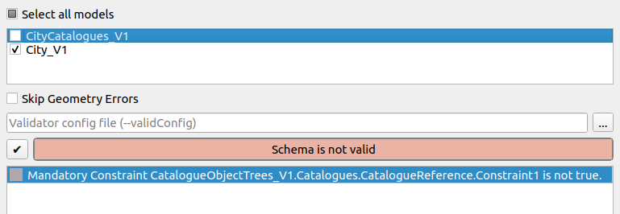

## What are catalogues and how they are used

Instead of using static enumeration domains in the INTERLIS model, catalogues can be used to look up enumeration values. The catalogues structure can be defined in the same model or externally and the (enumeration) data is stored in an INTERLIS transfer file. See the examples below.

### Using enumeration domains

```
INTERLIS 2.3;

MODEL City_V1 (en)
AT "https://models.opengis.ch"
VERSION "2022-06-22" =
  DOMAIN
    MaterialType = (
        Wood,
        Concrete,
        Plastic
    );

  TOPIC Constructions =
    OID AS INTERLIS.UUIDOID;

    CLASS Building =
      Name : TEXT;
      Material : MaterialType;
    END Building;

  END Constructions;
END City_V1.
```

This is super simple. But to add a new value to the enumeration, one needs to update the entire model. That's why modelers consider catalogues.

### Using values in a catalogue

```
INTERLIS 2.3;

MODEL City_V1 (en)
AT "https://models.opengis.ch"
VERSION "2022-06-22" =
  IMPORTS CityCatalogues_V1;

  TOPIC Constructions =
    OID AS INTERLIS.UUIDOID;
    DEPENDS ON CityCatalogues_V1.Catalogues;

    CLASS Building =
      Name : TEXT;
      Material : CityCatalogues_V1.Catalogues.MaterialRef;
    END Building;

  END Constructions;
END City_V1.
```

This model here uses the external catalogue `CityCatalogues_V1` which is based on the [`CatalogueObjects_V1`](http://models.geo.admin.ch/CH/CHBase_Part3_CATALOGUEOBJECTS_V1.ili).

```
INTERLIS 2.3;

MODEL CityCatalogues_V1 (en)
AT "https://models.opengis.ch"
VERSION "2022-06-22" =
IMPORTS CatalogueObjects_V1;

  TOPIC Catalogues =
    OID AS INTERLIS.UUIDOID;

    CLASS MaterialItem
    EXTENDS CatalogueObjects_V1.Catalogues.Item =
      Name : MANDATORY TEXT;
    END MaterialItem;

    STRUCTURE MaterialRef
    EXTENDS CatalogueObjects_V1.Catalogues.CatalogueReference =
      Reference (EXTENDED) : REFERENCE TO (EXTERNAL) MaterialItem;
    END MaterialRef;
  END Catalogues;
END CityCatalogues_V1.
```

The values are stored in an INTERLIS transfer file (still for catalogues mostly the file extension `.xml` is used instead of `.xtf`).
```xml
<?xml version="1.0" encoding="UTF-8"?><TRANSFER xmlns="http://www.interlis.ch/INTERLIS2.3">
<HEADERSECTION SENDER="ili2gpkg-4.6.1-63db90def1260a503f0f2d4cb846686cd4851184" VERSION="2.3"><MODELS><MODEL NAME="CityCatalogues_V1" VERSION="2022-06-2" URI="https://modelbaker.ch"></MODEL></MODELS></HEADERSECTION>
<DATASECTION>
<CityCatalogues_V1.Catalogues BID="b1e196b7-7d1a-4512-a5c2-5f36f52ba2cc">
<CityCatalogues_V1.Catalogues.MaterialItem TID="db473781-7aec-4100-80eb-9b366b05ffe5"><Name>Wood</Name></CityCatalogues_V1.Catalogues.MaterialItem>
<CityCatalogues_V1.Catalogues.MaterialItem TID="e17b72cb-e6fc-4e5e-ad2e-25b1d132b050"><Name>Plastic</Name></CityCatalogues_V1.Catalogues.MaterialItem>
<CityCatalogues_V1.Catalogues.MaterialItem TID="a29e59ff-ab78-43cd-8a0d-9ab64037c4dd"><Name>Concrete</Name></CityCatalogues_V1.Catalogues.MaterialItem>
</CityCatalogues_V1.Catalogues>
</DATASECTION>
</TRANSFER>
```

Since the values are now based on a class, additional attributes can be specified. This way, additional information can be provided and multilingualism can be supported.

### Implementation
The QGIS form created by Model Baker looks mostly the same as with enumerations.


!!! Note
    With Model Baker using `smart1Inheritance` or `smart2Inheritance` and per default the parameter `--coalesceCatalogueRef` ili2db creates the foreign keys directly in the class (`Building`) that references the item (`MaterialItem`). This means the table created according to the reference stucture (`MaterialRef`) does not contain any data.

## Multiple selection with BAG OF

If BAG OF attributes are used in the INTERLIS model, the reference structure `MaterialRef` is implemented as a link table.

```
    CLASS Building =
      Name : TEXT;
      Material : BAG {1..*} OF CityCatalogues_V1.Catalogues.MaterialRef;
    END Building;
```

Model Baker uses a Relation Editor Widget for it.


!!! Warning
    When importing the models with `--schemaimport` you should never import the catalogue model `CityCatalogues_V1` first when using BAG OF. The reason is that in this case the table based on the reference structure `MaterialRef` cannot be created with a foreign key to the table based on the class `Building`, because this model is not imported yet. Anyway when importing `City_V1`, `CityCatalogues_V1` is imported properly via dependency by ili2db.

### What baskets do those data belong?

On using baskets like described [here](../../background_info/basket_handling/) confusion may arise as to where in the physical database the data of the `MaterialRef` linking table should be assigned to. Since the  `MaterialRef` is designed in the topic of the Catalogue but the data are not "part" of the catalogue data. Anyway, we should not worry about this. Because a `STRUCTURE` (like`MaterialRef`) cannot exist by its own and is always part of its owner object (what in our case is `Building`), it doesn't matter what is entered in the `t_basket` column. It's anyway exported (and validated) as part of the `Building` object.

## Using Tree Catalogues

You can also find models that use `CatalogueObjectTrees_V1`. This means that the catalog values are stored in a tree structure:

```
├── Concrete
│   ├── Reinforced Concrete
│   └── Prestressed Concrete
└── Wood
    ├── Oak
    ├── Teak
    └── Birch
```

The external catalogue model looks like this:

```
INTERLIS 2.3;

MODEL CityCatalogues_V1 (en)
AT "https://models.opengis.ch"
VERSION "2022-06-22" =
IMPORTS CatalogueObjectTrees_V1;

  TOPIC Catalogues =
    OID AS INTERLIS.UUIDOID;

    CLASS MaterialItem
    EXTENDS CatalogueObjectTrees_V1.Catalogues.Item =
      Name : MANDATORY TEXT;
    END MaterialItem;

    STRUCTURE MaterialRef
    EXTENDS CatalogueObjectTrees_V1.Catalogues.CatalogueReference =
      Reference (EXTENDED) : REFERENCE TO (EXTERNAL) MaterialItem;
    END MaterialRef;
  END Catalogues;
END CityCatalogues_V1.
```

And the data look like this:

```xml
<?xml version="1.0" encoding="UTF-8"?><TRANSFER xmlns="http://www.interlis.ch/INTERLIS2.3">
<HEADERSECTION SENDER="ili2gpkg-4.6.1-63db90def1260a503f0f2d4cb846686cd4851184" VERSION="2.3"><MODELS><MODEL NAME="CityCatalogues_V1" VERSION="2022-06-2" URI="https://modelbaker.ch"></MODEL></MODELS></HEADERSECTION>
<DATASECTION>
<CityCatalogues_V1.Catalogues BID="b1e196b7-7d1a-4512-a5c2-5f36f52ba2cc">
<CityCatalogues_V1.Catalogues.MaterialItem TID="a29e59ff-ab78-43cd-8a0d-9ab64037c4dd"><IsSuperItem>true</IsSuperItem><IsUseable>false</IsUseable><Name>Concrete</Name></CityCatalogues_V1.Catalogues.MaterialItem>
<CityCatalogues_V1.Catalogues.MaterialItem TID="db473781-7aec-4100-80eb-9b366b05ffe5"><IsSuperItem>false</IsSuperItem><IsUseable>true</IsUseable><Parent REF="a29e59ff-ab78-43cd-8a0d-9ab64037c4dd"></Parent><Name>Reinforced Concrete</Name></CityCatalogues_V1.Catalogues.MaterialItem>
<CityCatalogues_V1.Catalogues.MaterialItem TID="e17b72cb-e6fc-4e5e-ad2e-25b1d132b050"><IsSuperItem>false</IsSuperItem><IsUseable>true</IsUseable><Parent REF="a29e59ff-ab78-43cd-8a0d-9ab64037c4dd"></Parent><Name>Prestressed Concrete</Name></CityCatalogues_V1.Catalogues.MaterialItem>
</CityCatalogues_V1.Catalogues>
</DATASECTION>
</TRANSFER>
```

Depending on the modeling, first level items may or may not be used.

!!! Note
    Enumerations can be structured as trees as well.

### Special case on export / validation data with tree structured catalogues

It's not possible to export data with validation from a model that uses codelists with `CatalogueObjectTrees_V1` without also exporting the catalogue data.



#### Reason
There is a constraint in the class `CatalogueReference` of [`CatalogeObjectTrees_V1`](http://models.geo.admin.ch/CH/CHBase_Part3_CATALOGUEOBJECTS_V1.ili):
```
  MANDATORY CONSTRAINT
    Reference->IsUseable;
```
Because the content of `CatalogueReference` is part of the user data. B However, the information whether this reference is usable is in the catalogue data. Therefore, the user data cannot be exported with a successful validation if the catalogue data is not exported as well.

#### Sollution
You need to export/validate your data toghether with the catalogue data, or check your data with the validator and export it afterwards with disabled validation - but be aware that your transfer file data will be invalid afterwards.


!!! Note
    In INTERLIS 2.4 model `CatalogueObjectTrees_V2` this will be solved.
