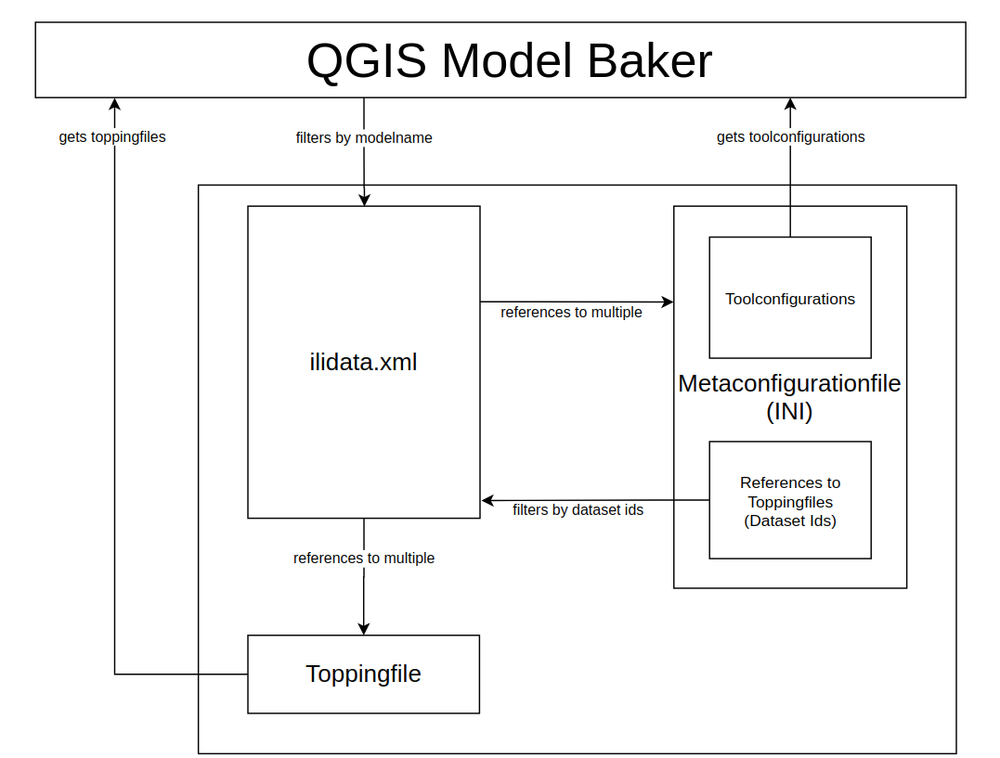

## What it is about

With Model Baker **additional information** for models can be found automatically via the web. Additional information such as **ili2db settings**, **QGIS project configurations** and **data files** important for your model (such as catalogs).

This means that complex configurations can be made **once** and used multiple times.

### Metaconfiguration

The **metaconfiguration** can be found before creating the physical data model on the **Schema Import Configuration** page.

The **metaconfiguration** can contain the **ili2db settings** as well as links to the required **QGIS project configurations (toppings)** and **data files (referenced data)**. This means the **metaconfiguration**

The **ili2db settings** can also be overridden manually.

### Referenced data

The **referenced data** required for a model, such as catalogs and codelists, can be found in the **Data Import Configuration**.

They may already have been linked via the **metaconfiguration** before as well.

### Toppings

The **QGIS project configurations** or **toppings** can - if not already linked via the **metaconfiguration** - be found each time on the **Project Generation** page via a **projecttopping** file.

The **projecttopping** defines general project configurations such as layertree, variables etc. and links to the required **toppings** such as layerstyle etc. which are then downloaded and applied when the project is generated.

## Where do those additional information come from?

Just as we can now find INTERLIS models by searching the ilimodels.xml files on the repositories we can find this additional information via the `ilidata.xml` file. It filters the entries by the name of the used **INTERLIS model**.

More information about the technical background you can find [here](../../background_info/usabilityhub/technical_concept)

## Usual Workflows

All these **additional information** are concernig a specific model. That's why they are found according to the selected model's name.

### On choosing a **metaconfiguration**

...that links to **referenced data** and a **projecttopping** the workflow looks like this:

1. The user enters the model name in the **Source Selection**
2. The *ilidata.xml* is parsed for links to *metaconfiguration files* according to the model name.
3. The user selects a *metaconfiguration*.

    
4. The *metaconfiguration file* is downloaded.
5. The configurations are read from the *metaconfiguration*.
6. The configurations are considered in the creation of the physical model.
7. The DatasetMetadata-Ids to the *referenced data* are read from the *metaconfiguration*.
8. The *ilidata.xml* is parsed for links to the *referenced data* based on the DatasetMetadata-Ids.
9. The *referenced data files* are downloaded and imported.
10. The DatasetMetadata-Ids to the *projecttopping* is read from the *metaconfiguration*.
11. The *ilidata.xml* is parsed for links to the  *projecttopping* based on the DatasetMetadata-Ids.
12. The *projecttopping file* is downloaded.
13. The DatasetMetadata-Ids to the *other toppings* (like layerstyles etc.) is read from the *projecttopping*.
14. The *ilidata.xml* is parsed for links to the  *toppings* based on the DatasetMetadata-Ids.
15. The *topping file* are downloaded.
16. The information is read from the *projettopping* and the linked *toppings* and included in the generation of the QGIS project.

### On choosing **referenced data** directly

...from the repositories in the **Data Import Configuration** the steps are:

1. The *ilidata.xml* is parsed for links to the *referenced data* according to the model name.
2. The user selects *referenced data*.

    
3. The *referenced data files* are downloaded and imported.

!!! Note:
  The links to the *referenced data* are found according to the used model name.

### On choosing**project topping** directly

... from the repositories in **Project Generation** the steps are:

1. The *ilidata.xml* is parsed for links to the *projecttoppings* according to the model name.
2. The user selects a *projecttopping*.

    
3. The *projecttopping file* is downloaded
4. The DatasetMetadata-Ids to the *other toppings* (like layerstyles etc.) is read from the *projecttopping*.
5. The *ilidata.xml* is parsed for links to the  *toppings* based on the DatasetMetadata-Ids.
6. The *topping file* are downloaded.
7. The information is read from the *projettopping* and the linked *toppings* and included in the generation of the QGIS project.

!!! Note:
  The links to the *projecttopping* are found according to the used model name.

!!! Note:
  A *projecttopping* can be chosen from the local system as well.
