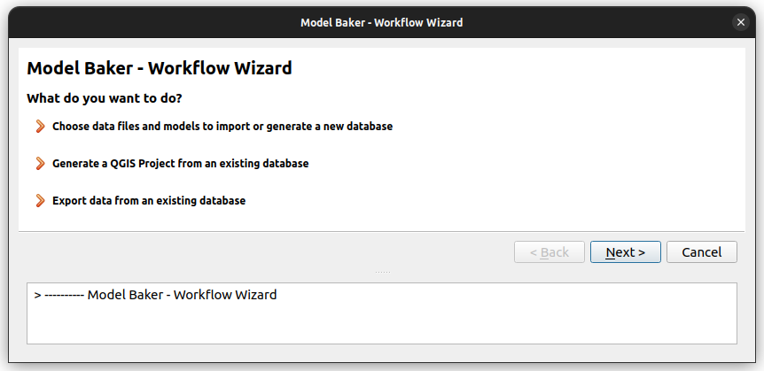
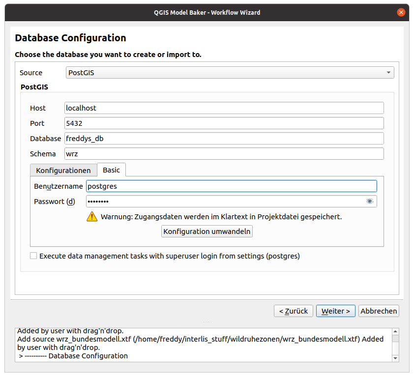
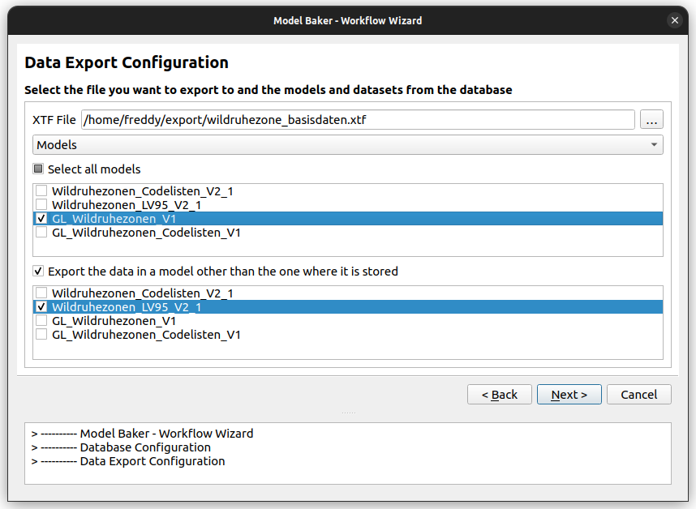

You can export your data from an physical database into an `xtf` file (INTERLIS transfer file).

The wizard is started over the toolbar icon or *Database > Model Baker > Import/Export Wizard*.

Select *Export data from an existing database*.

## 1. Database Selection

First you have to select the database schema or file to export your data from.

For more detailed description of the connection parameters, see the description in the [import workflow](../import_workflow/#database-selection)

When the database or the schema / file does not exist, a warning will appear.

## 2. Export data

### XTF File

Set the `xtf` file where you want to export your data to.

### Filters

You can filter the data *either* by models *or* - if the database considers [Dataset and Basket Handling](../../background_info/basket_handling/) - by datasets *or* baskets. You can choose multiple models/datasets/baskets. But only one kind of filter (`--model`, `--dataset`, `--basket`) is given to the ili2db command (it would make no conjunction (AND) but a disjunction (OR) if multiple parameters are given (what is not really used). A conjunction can still be done by selecting the smallest instance (baskets)).

### Export Models

The export models do not define the data that should be exported, but in what *format* they should be exported. This is relevant if you use *extended* models: You have your data stored in your extended model, but you export it in the *format* of the base model.

!!! Note
    When no model is selected, the data are exported in the format of the model it is saved in. Multiple model selection makes sense here, when you have multiple models extended.

## 3. Run ili2db Sessions

In the next step you can run the export in one single ili2db command.

With the  button next to *Run* the options are provided to run the command without any validation of your data or to edit the command manually before running it.

### Data Validation

If you did not choose *Run without constraints* on your export session, then the data are validated against their INTERLIS models. If this validation did not succeed, then the export will fail.

To check your data in advance against the INTERLIS model, use the [Model Baker Validator](../validation/).
