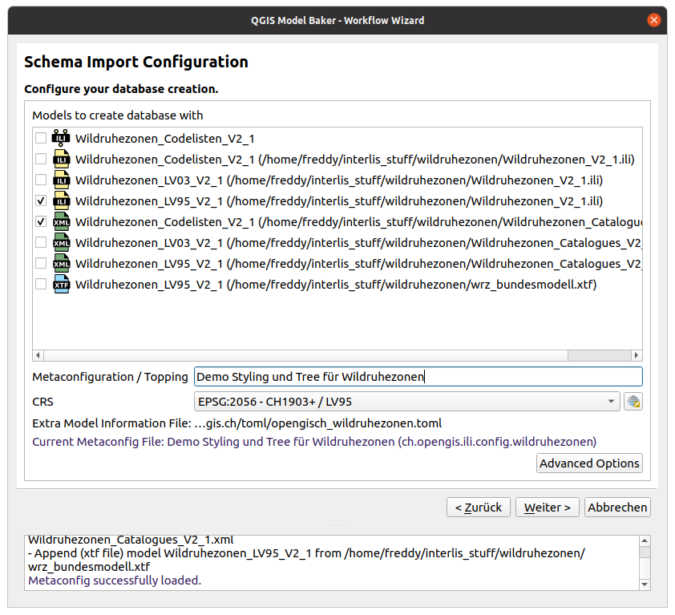
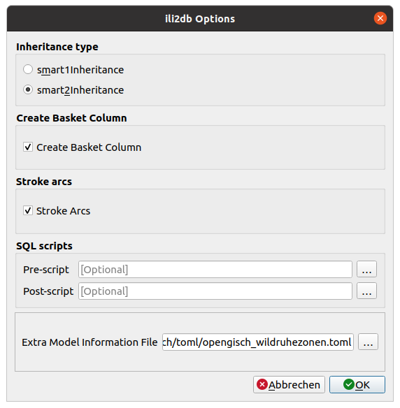
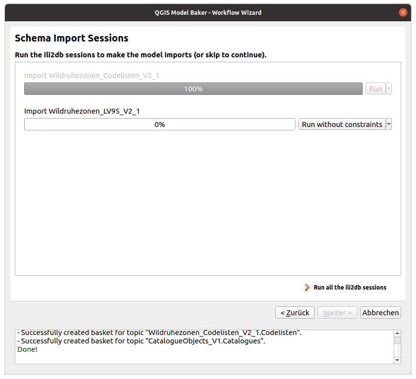
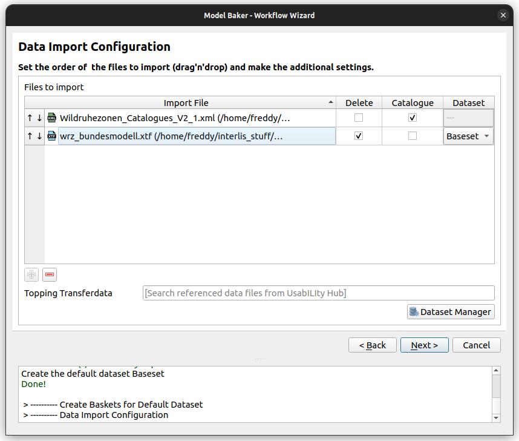
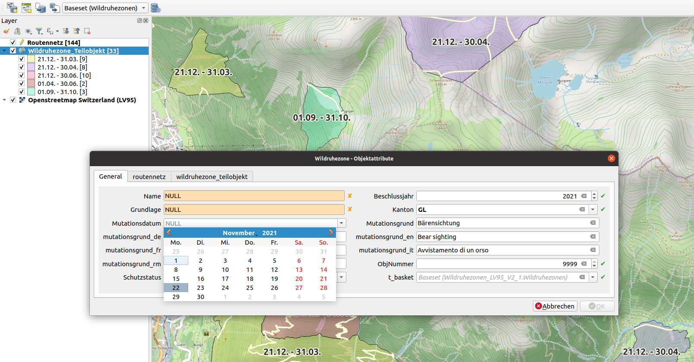
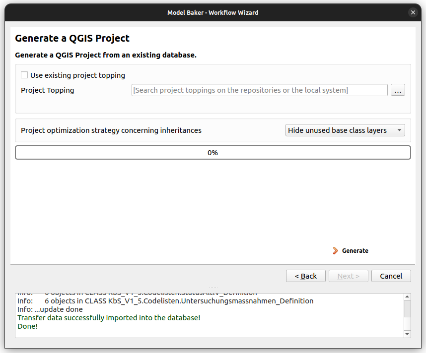

The wizard is started over the toolbar icon or *Database > Model Baker > Import/Export Wizard*.

To [choose data files and models to import or generate a new database](#source-selection) follow the description below. To [generate a QGIS project from an existing database](#generate-the-qgis-project) jump to the bottom of this guide. To [export data from an existing database](../export_workflow/) see the guide for that.

!!! Note
    As well the Wizard opens when you drop a file to QGIS with the extension `xtf`, `ili` or `xml` (`xml` only when it's dropped with a file having one of the other extensions).

## Source Selection
First page offers you to select the sources to import.

### INTERLIS Models
Sources can be INTERLIS models stored in `ili` files you select from your local system (with the file browser  or with drag'n'drop).

As well you can search for INTERLIS models in the [repositories](../../background_info/repositories) or [custom model directories](../plugin_configuration/#custom-model-directories). Since model names should be given strictly as they were spelled in INTERLIS files, once you start typing, autocompletion will help you discover available models with their correct spelling. Add them wiht the .

!!! Note
    The models from the repositories are cached locally. If you want to clear this cache, use the button *Clear ilicache*.

This leads you to a process to create the physical database in *PostgreSQL*, *MSSQL* or *GeoPackage*.

### Transfer and Catalogue Files (Data Files)
The `xtf` is an INTERLIS transfer file, containing spatial and/or alphanumeric data stored in XML format. Catalogues or Codelists are technically the same but have usually `xml` as extension.

The selection of data files leads you to the process to import the data into a physical database.

## Database Selection

In any case you are requested to set the connection to your database.

- **Database Host** Set the host of the database server. By default is localhost.
- **Database Port** Set the port of the database server. By default is 5432.
- **Database Name** Set the database name. The database should exist already.
- **Database Schema** The schema acts like a folder, it helps you to organize database objects like tables and relations and isolate them from other schemas. Set the database schema where you want to create the physical model or import the data from the transfer file to. You can even choose an existing schema where you create a new physical model, but you’d better know what you’re doing, because it will overwrite previous ili2db configurations.
- **Database User** Set the user to access the database.
- **User Password** Set the password for the database user.
- **Execute data management tasks with superuser login from settings** If checked, it uses the superuser login (set in the [plugin configurations](../plugin_configuration/) for data management tasks like the creation of the schema etc.

## Import of INTERLIS Model
### Model selection
There are several ways the Model Baker wizard detects INTERLIS models to import.

- Read from the selected local `ini` file.
- Selected from the repositories.
- Parsed from the selected transfer or catalogue files.
- Depending model of a catalogue referenced in the ilidata.xml of the repositories.
- Defined as ili2db attribute in the metaconfiguration received from the repositories. See [UsabILIty Toppings](../../background_info/usabilityhub/modelbaker_integration).

When you only got a model name (like in all cases except the one of the local `ini` files) the models are searched in the [repositories](../../background_info/repositories) or [custom model directories](../plugin_configuration/#custom-model-directories). It's possible that the models are listed multiple times coming from different sources. It's up to you what source you choose.

You can check or uncheck the models you want to import to a physical schema.

### Metaconfiguration / Topping

Choose a metaconfiguration file found on the [repositories](../../background_info/usabilityhub/modelbaker_integration/) to load ili2db settings and styling properties to your QGIS project.

### Ili2db settings
Since Model Baker uses ili2db, you can set advanced options that determine how your conceptual object-oriented model is mapped into a physical model.

#### Inheritance type

Ili2db allows you to use three types of inheritance mapping:

- ***noSmartMapping*** maps all classes from the source INTERLIS model into the target database schema. Each class maintains all its attributes. Model Baker does not provide this option in the settings.
- ***smart1inheritance*** prefers to create parent classes into the database, as long as they fulfill some specific requirements. Attributes from children classes will not be lost, since they are transferred into parent ones.
- ***smart2inheritance***: prefers to create children classes into the database. Attribute from parent classes will not be lost, since they are transferred into children ones.

### Create Basket Column

With this option you activate the [Dataset and Basket Handling](../../background_info/basket_handling/) in your physical model.

When this option is checked, Model Baker passes `--createBasketCol` to the ili2db command. Ili2db creates a new column `T_basket` in class tables which references entries in the additional table `t_ili2db_baskets`. The `T_basket` column needs to be filled with the basket to which an object belongs.

!!! Note
    If `BASKET OID` is defined in the model, it's required to use the basket handling in QGIS (we need to create the physical model the ili2db parameter `--createBasketCol`). This is currently not automatically detected by the Model Baker and needs to be assured by the user.

When the dataset and basket handling is enabled, a default Dataset called `Baseset` will be created and the [page for basket creation](#create_baskets) will appear after schema import.

### Stroke Arcs

If this option is activated, circular arcs are stroked when importing the data.

### SQL Scripts

You can define `sql` scripts that runs before and after the (schema) import.

### Extra Meta Attribute File

A `toml` or `ini` file can contain values for [meta attributes](../../background_info/meta_attributes/) (like `qgis.modelbaker.dispExpression`) instead of having them directly in the `ili` file.

## Run ili2db Sessions

In the next step you can run all the sessions to create your physical model. If having multiple models selected that are received from the repositories, then they are passed in one command. You can run the commands one by one or all together.

With the  button next to *Run* the options are provided to run the command without checking constraints or to edit the command manually before running it.

## Create Baskets

In case you don't have data to import into your default dataset and want to collect ***fresh*** data in QGIS, the baskets have to be created as well. It's up to you for what topics you want to create baskets. Model Baker suggests you what baskets should be created and reasonalbe values for the BID (value in the `t_ili_tid`) but you might need. to edit them.

If you don't know what it is about, check more details [here](../../background_info/basket_handling/#creation-of-baskets) or just press *Create baskets* and then *Next*.

## Import of INTERLIS Data

After the physial model is generated or you selected an existing database to import your transfer or catalogue files to containing the models already, you will see the page to set up your data imports.

### Import order

While the order to import the INTERLIS models are not important (usually, see [exceptions](../../background_info/catalogues/#multiple-selection-with-bag-of)), the data import often requires the correct order. Transfer data often depends on existing catalogue / codelist data. Drag and drop your files with  to the right order.

### Dataset Handling

The [Dataset and Basket Handling](../../background_info/basket_handling/) is only active, when the physical model has been created with *Create Basket Column* (`--createBasketCol`).

If so, the data are imported with the ili2db parameter `--update`. This means that all the existing data in the same basket are updated (and removed if not existent in the transfer file).

Select the dataset you want to import your data to by double-click the dataset field. If you want to create a new dataset, use the [dataset manager](../../background_info/basket_handling/#dataset-manager). The baskets are created during the import of the data.

If the data to import is a catalogue, please select the checkbox for *catalogue* and it will be imported into a dataset made for catalogues (called `catalogueset`).

### Transfer Data from the repositories

Not only meta data for ili2db and styling can be received over the ilidata.xml from the repositories. As well there can be found catalogue data referenced over the model name. This means Model Baker checks the repositories for all the models contained in the database schema. If it founds referenced catalogue data it provides them to you in the autocomplete widget. Add them with the  (the needed models have been suggested in the [INTERLIS model import](#import-of-interlis-model) already).

Check more information about the catalogues on the repositories [here](../../background_info/usabilityhub/modelbaker_integration/#directly-referenced-catalogues).

### Delete data first

If you want to delete the data in the database first, you can check the corresponding box. On using baskets, the ili2db parameter `--replace` is executed instead of `--update`. On not using baskets, the parameter `--deleteData` is added to the command. Note that on using baskets, only the data from the corresponding dataset is deleted, whereas on not using baskets all data from the schema is deleted.

## Generate the QGIS Project

In case you want to generate your project from an existing database, you will need to [set the connection parameters](#database-selection) first.

Then, with a simple click you generate your project. All the toppings received from the *repositories* are considered here.

Easy as that. Still you can choose some more options.

### Choose a Project Topping

If you have already selected a metaconfiguration file [previously](#metaconfiguration-topping) and this metaconfiguration file refers to a project topping file (`YAML` file containing the layer tree and links to the layer style files), it is taken into account by default. If you create the project from an existing database, Model Baker checks whether this schema was created with a meta configuration file to consider here. If this is not the case, or if you simply want to select a different file, this option is also available. Get your project topping file from the repositories or from your local system.

### Optimize QGIS Project if extended

In case you gereate your project for an extended model structure that was created with *smart2inheritance*, then you can optimize it (hide or group unused layers and relations).

Choose your optimization strategy in the checkbox:

- ***Hide unused base class layers***
  Base class layers with same named extensions will be *hidden* and and base class layers with multiple extensions *as well*. Except if the extension is in the *same model*, then it's will *not* be *hidden* but *renamed*.

  Relations of hidden layers will *not* be *created* and with them *no* widgets

- ***Group unused base class layers***
  Base class layers with same named extensions will be *collected in a group* and base class layers with multiple extensions *as well*. Except if the extension is in the *same model*, then it's will *not* be *grouped* but *renamed*.

  Relations of grouped layers will be *created* but the widgets are *not applied* to the form.

For more information about the optimization of extended models, see the [corresponding chapter](../../background_info/extended_models_optimization).

### OID Values

Often the models definition requires cross-system unique identificators. So called OIDs, what are represented in the physical database as the `t_ili_tid` column. Find a clear definition and more details about them in the [corresponding chapter](../../background_info/oid_tid_generator).

On creating a QGIS Project with Model Baker, there are preset default value expression generated for the `t_ili_tid` field on the attribute form. But often those default value expressions need to be edited by the user (like e.g. the prefix in the `STANDARDOID`).

Here you can use the QGIS Expression Dialog to edit the default value expression for the `t_ili_tid` field of each layer.

If you need a counter in the expressions, you can use the `t_id` field, that has a schema-wide sequence counting up. This sequence can be reset as well by the user, but be careful not to set it lower than already existing `t_id`s in your project.

This settings can be made on an existing QGIS Project as well. Find the [OID Manager](../../background_info/oid_tid_generator/#tid_(oid)_manager) via the *Database > Model Baker* menu.
