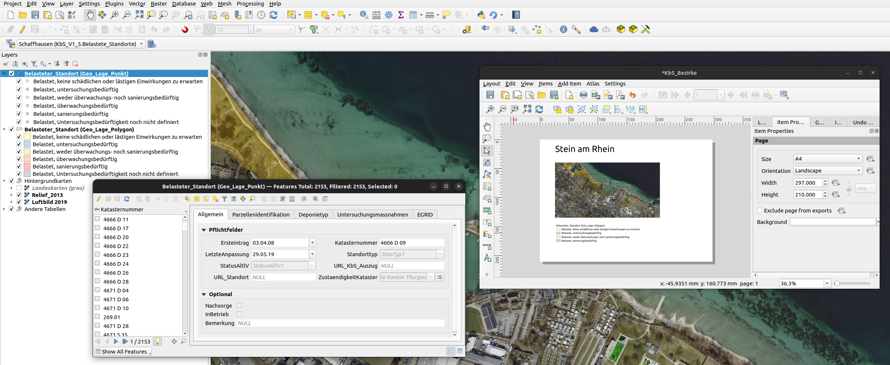
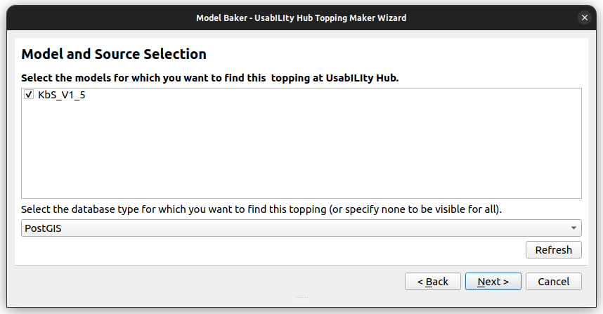
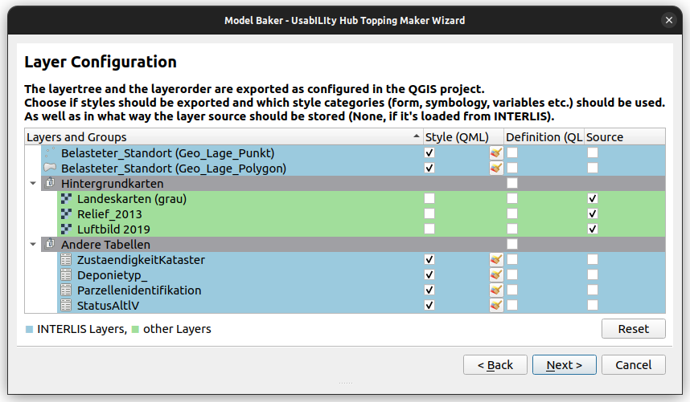
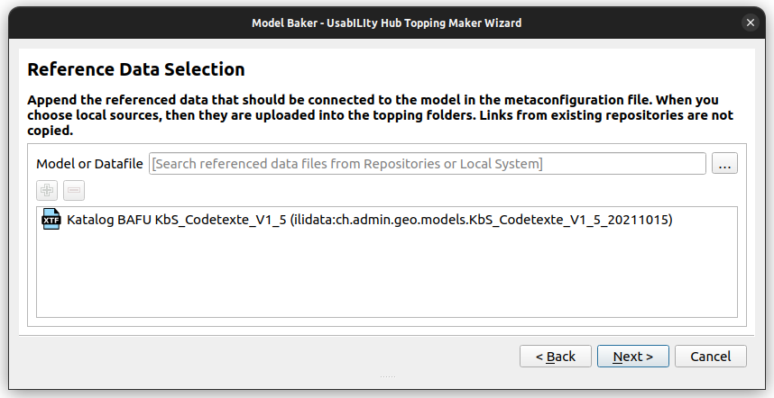
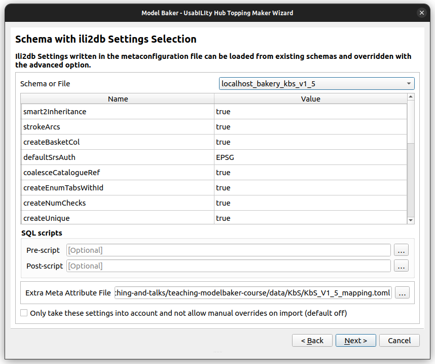
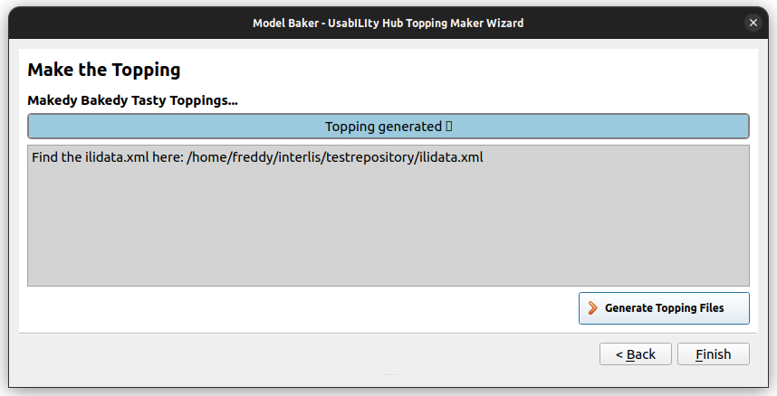

After importing the INTERLIS model and creating the QGIS project with Model Baker, you have made many additional configurations and settings.

- Categorized layer symbology
- Form configurations
- Changes to the layer tree
- Additional WMS layers
- Project variables
- Print layouts
- ...and much more

Since you don't want to make these settings again and share your work with others, you decide to create your own metaconfiguration and toppings and make them available in your repository.

So, find the **Topping Exporter** in the menu *Database > Model Baker > UsabILItyHub Topping Exporter*

## 1. General information about the topic

First you need to enter some general information about your topic. This will be in the index file (ilidata.xml) and defines the folder structure.

## 2. Model and Source

Your currently opened project is parsed for INTERLIS models on which it is based.

Your metaconfiguration and your project topping will be filtered by this model name(s).

Normally your project is based on one model, but if there are others, you can deactivate them as filter parameters.

Also the available metaconfigurations and toppings will be filtered by the data source (as most toppings created for PostGIS do not work for GeoPackage and vice versa).

If you do not wish to filter by data source, select "No source defined (allow all)".

## 3. Project Layers

On this page you can see the layer tree of your current project and you can specify how you want to save the layer information to the topping files.

- With **Style (QML)** all layer settings (symbology, shapes, layer variables, etc.) are written to a layer style (`qml`) fle. This means that it can be applied to a layer with a different data source. This is the ideal case for the toppings you want to apply to the layers of your INTERLIS model.

    This  button opens a dialog in which you can select which styling properties are to be taken into account.

- With **Definition (QLR)** the complete layer definition including source path and styling is saved into a `qlr` file. This is useful for layers that are not based on the INTERLIS model for which you are creating your topping. In this example it would perhaps make sense to save the "Hintergrundkarten" group in a definition file.

- With **Source** only the original data source path is written directly to the project topping file. This is useful for WMS layers or layers from accessible databases that are not based on INTERLIS models (or at least not on the ones for which we use this topping)

!!! Note
        If you want to remove layers, then you can do that in your project and press "Reset" in the Topping Exorter.

## 4. Variables and Print Layouts

There are other settings that are automatically exported and that you cannot activate or deactivate. For example:
- Layer Order
- Transaction Mode

For some specific configurations, however, it is useful to decide what should be exported. On this page, you can select or unselect your map themes, variables and print layouts.

## 5. Referenced Data (Catalogues)

Your metaconfiguration can reference a data file (such as a catalog) that Model Baker automatically finds and imports.

Here you can add a local file (which will be added to your setup) or select an existing file from the public repositories.

## 6. ili2db Settings

Finally, you can select whether the ili2db settings of your current schema (means the ili2db settings that has been used to create your current schema) should be considered.

!!! Note
    Please note that only the settings "known" by Model Baker are parsed. These are the parameters that are automatically set by Model Baker or can be set by the user in the advanced options. If you have edited your ili2db command manually (or have not created it via Model Baker), some settings may be missing.

You can also select any required SQL scripts and an [extra meta attribute file](../../background_info/meta_attributes.md).

## 7. Generate your files

Generate your files. At least one metaconfiguration and one project topping file as well as all required topping files (`qml`, `qlr` etc.) are created

## 8. Taste your toppics

Test your toppics locally before adding them to your repository. Do this by adding the path of your toppings as [custom model directory](../user_guide/plugin_configuration/#custom-model-directories). `ilidata.xml` and `ilimodels.xml` are searched and parsed in it.

